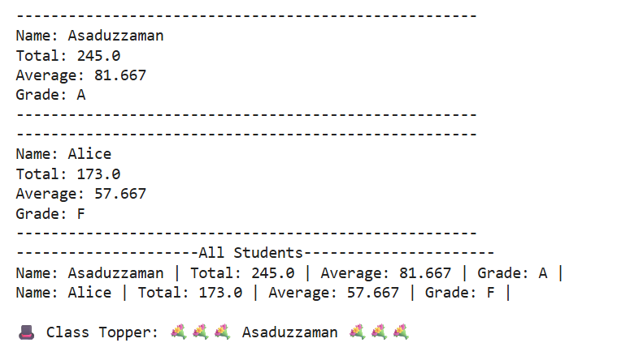

# Week 2 — Python Functions
Practice programs and mini-project focused on defining and using functions in Python.

## 🧩 Topics
- Function Definition & Return Values
- Default & Keyword Arguments
- Loops + Functions
- Input Validation

## 💻 Mini Project
**Student Result System**
- Calculates total, average, and grade for multiple students
- Modular structure using separate functions
- Demonstrates code reusability and organization

## 📈 Example Output

